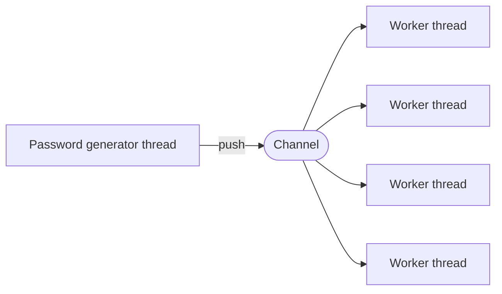

<samp>

# zip-Password-Grabber

**A password finder for protected ZIP files using a brute force strategy**

</samp>

## Architecture

# How to use!

## step 1
To use this script go to the Folder "encripted-zip-files" then add your files into that Folder
https://github.com/CPScript/Zip-Password-Grabber/tree/main/encripted-zip-files

## Step 2
To run the script go to https://Replit.com/~ and sign up

## Step 3
click create once you have signed up Then click import from github. 

## Step 4
Paist this into the Link Bar -->  https://github.com/CPScript/Zip-Password-Grabber.git  <--

## Step 5
Lastly Run the script and hopefuly it will try to find the password

# TAKE NOTE!!!!!
This goes throught around 5000000 passwords, the password your looking for might not be in the catigory
